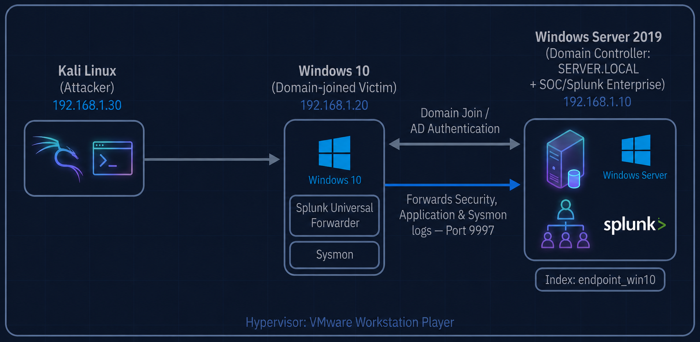

# Module 01: Architecture & Network Setup

## Overview

This module documents the network topology and connectivity setup for the Home SOC Environment before deploying Active Directory (Module 02) and Splunk (Module 03).

---

## Step 1: VM Topology



| Machine | Role | IP Address |
|---------|------|-------------|
| Kali Linux | Attacker | 192.168.1.X |
| Windows Server 2019/2022 | Domain Controller / SOC (Splunk) | 192.168.1.10 |
| Windows 10 | Domain-joined Victim | 192.168.1.20 |

---

## Step 2: Network Configuration


Configured static IPs on each machine to ensure consistent addressing across reboots (important for Splunk forwarder targeting and AD DNS resolution).

---

## Step 3: Verify Connectivity

From Kali, confirmed connectivity to the domain controller and victim machine:

```bash
ping 192.168.1.10   # Windows Server (DC / Splunk)
ping 192.168.1.20   # Windows 10 (victim)
```


This confirms all machines are reachable before proceeding with AD DS setup and Splunk deployment.

---

## Lessons Learned

- Static IPs prevent broken forwarder/DNS configs later — DHCP-assigned addresses can change and silently break Splunk forwarding or domain join.
- Verifying basic connectivity (ping) before touching AD or Splunk saves time troubleshooting "why isn't data flowing" issues that are actually just network issues.
- Keeping all VMs on the same isolated virtual network (VMware) avoids interference with the host network and keeps the lab self-contained.
