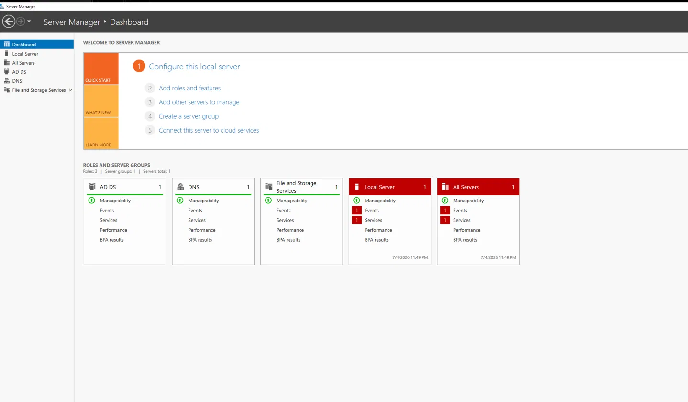
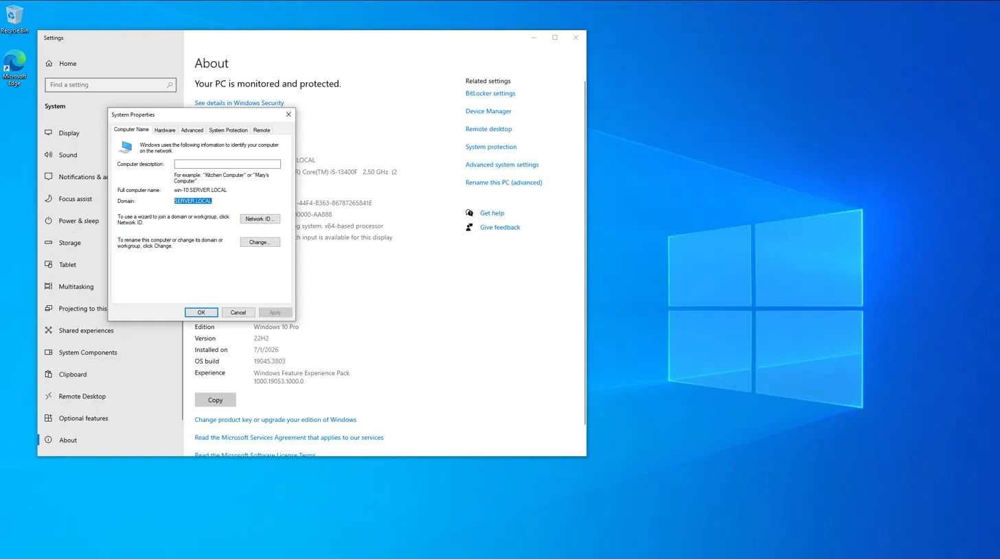
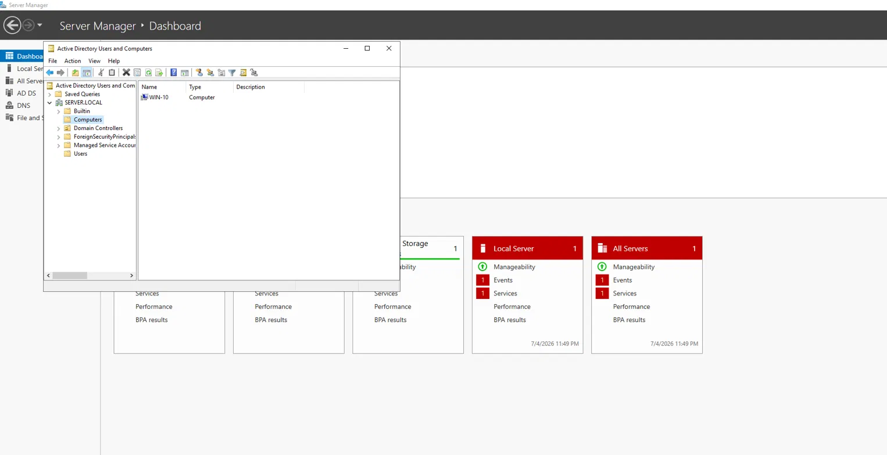
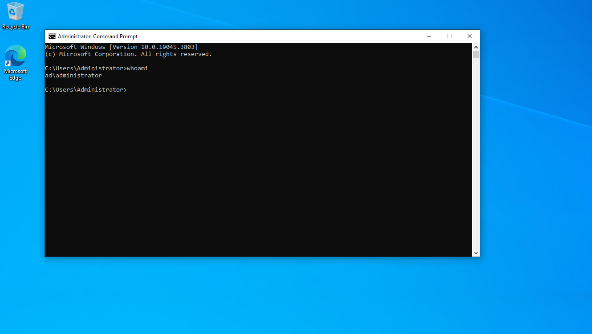

## Module 02: Active Directory Domain Setup

This module covers setting up Active Directory on the Windows Server 2019 VM and joining the Windows 10 VM to the domain.

**Domain:** SERVER.LOCAL (NetBIOS: AD)

| Machine | Role | IP Address |
|---|---|---|
| Windows Server 2019 | Domain Controller | 192.168.1.10 |
| Windows 10 | Domain-joined client | 192.168.1.20 |

### What was done

Installed the AD DS role along with RSAT tools, then promoted the server to a Domain Controller as a new forest (`SERVER.LOCAL`).

Joined the Windows 10 client to the domain using the `Administrator@SERVER.LOCAL` .

Confirmed the join worked by checking Active Directory Users and Computers on the server (WIN-10 shows up under Computers).

and by logging into win-10 with the domain account and running `whoami`, which returned `ad\administrator`.

### Lessons learned

### Next steps

- Module 03: Splunk deployment.
- Module 04: AD brute-force simulation and detection.
