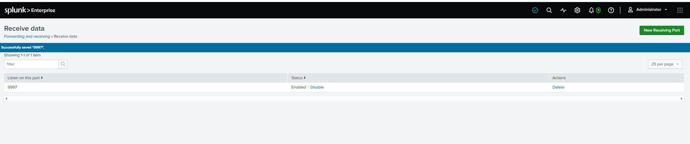
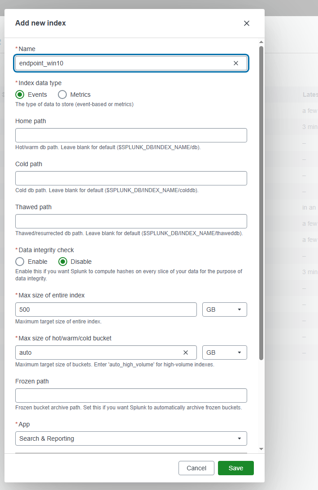
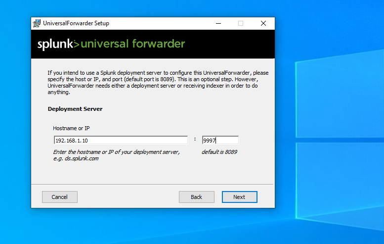
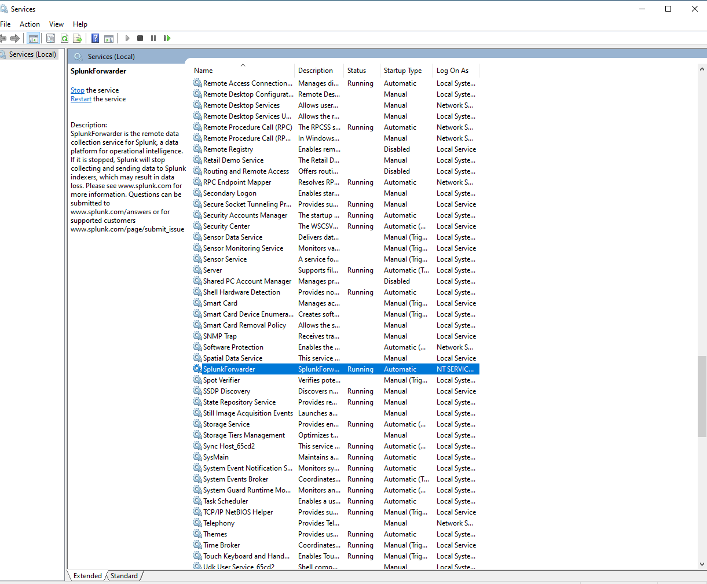
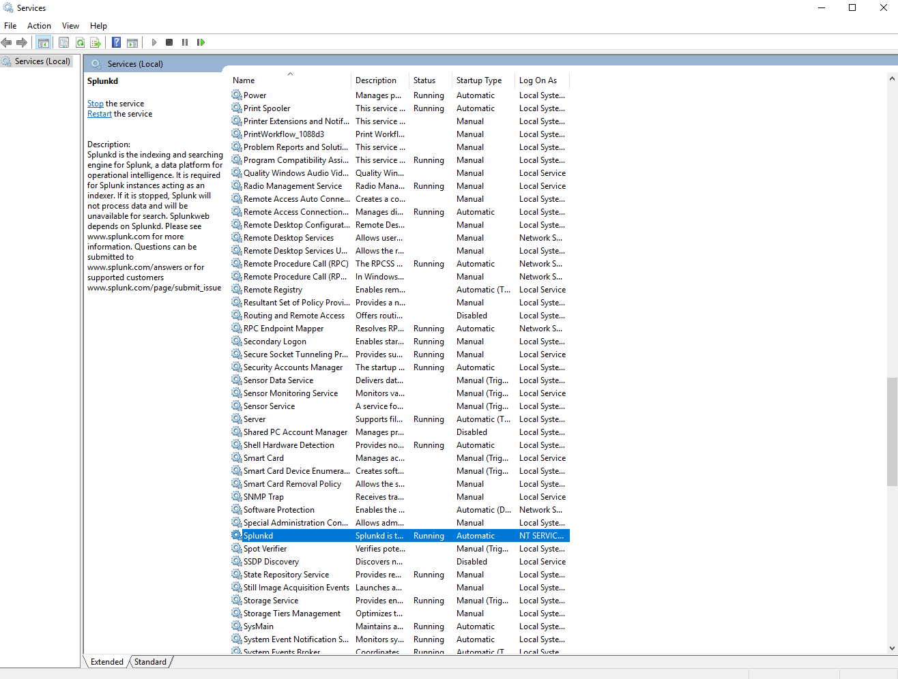
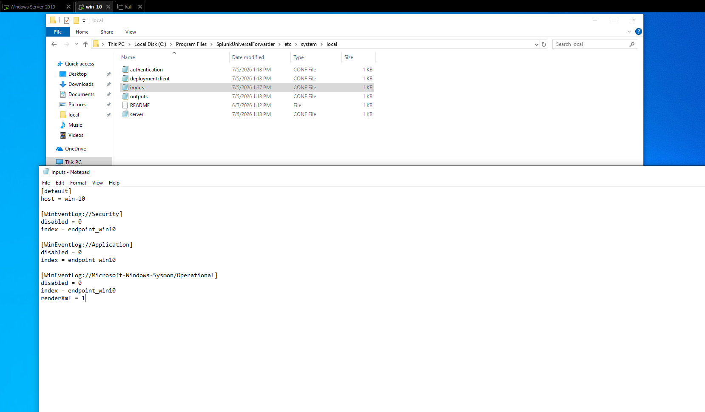
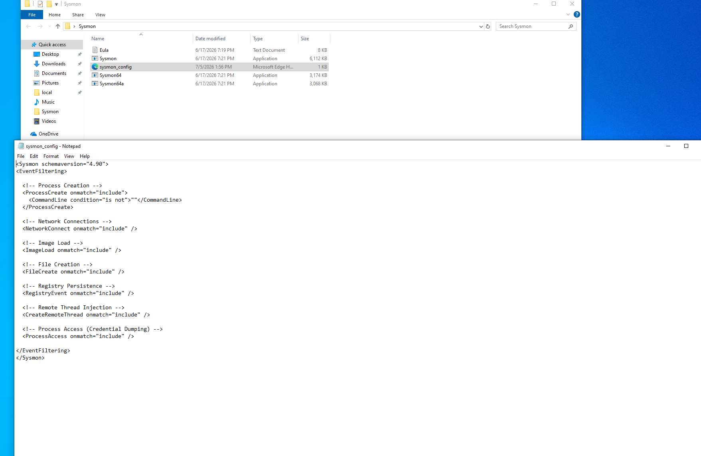
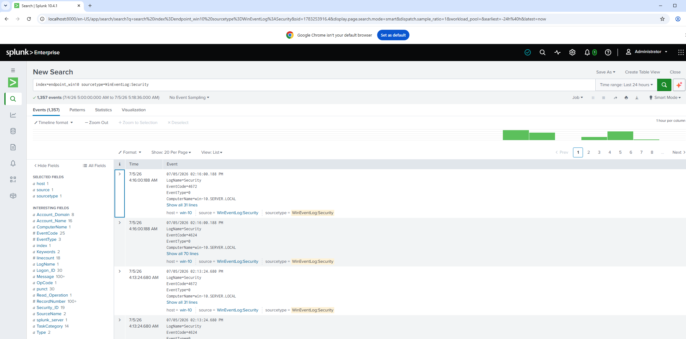

# Module 03: Splunk Deployment

> Part of the [Home SOC Environment](../Home-SOC-Environment-Overview.md) — a self-built lab (Windows Server + AD DS, Windows 10, Kali Linux, Splunk) that's still evolving as new components are added.

**Component:** Splunk Enterprise (Server) + Universal Forwarder (Windows 10) + Sysmon (Windows 10)

---

## Objective

Deploy Splunk as the SIEM, forward Windows 10 event logs to it, and add Sysmon for deeper endpoint visibility ahead of the attack simulation in Module 04.

---

## Step 1: Configure Receiving & Create an Index

Installed Splunk Enterprise on the Windows Server and enabled it to receive forwarded data on port **9997** (Settings → Forwarding and Receiving → Configure Receiving).



Created a dedicated index, **`endpoint_win10`**, instead of using the default `main` index — this keeps Windows 10 logs isolated for easier searching as more endpoints get added later. Verified it was saved correctly via `splunk list index` on the CLI.



---

## Step 2: Install the Universal Forwarder on Windows 10

Installed the Universal Forwarder on Windows 10 and pointed it at the Splunk Server:

- **Host/IP:** `192.168.1.10`
- **Port:** `9997`



Confirmed both services were running: **SplunkForwarder** on Windows 10 and **Splunkd** on the Server.




---

## Step 3: Configure Log Inputs (inputs.conf)

Edited `inputs.conf` on the forwarder (`...\SplunkUniversalForwarder\etc\system\local\`) to send Security, Application, and Sysmon logs into `endpoint_win10`:

```ini
[default]
host = win-10

[WinEventLog://Security]
disabled = 0
index = endpoint_win10

[WinEventLog://Application]
disabled = 0
index = endpoint_win10

[WinEventLog://Microsoft-Windows-Sysmon/Operational]
disabled = 0
index = endpoint_win10
renderXml = 1
```



---

## Step 4: Install Sysmon for Deeper Telemetry

> Originally planned as a future addition — installed now since the forwarder was already being configured for Windows 10.

Installed Sysmon with a custom config enabling process creation (with command lines), network connections, image loads, file creation, registry persistence, remote thread injection, and process access (credential dumping) monitoring.



---

## Verification

```spl
index=endpoint_win10 sourcetype=WinEventLog:Security
```

Security, Application, and Sysmon events from Windows 10 are now searchable in Splunk under `endpoint_win10` — confirmed with 1,357 events ingested over 24 hours.



---

## Lessons Learned

- **Dedicated indexes scale better** than dumping everything into `main`, especially once more endpoints are added.
- **The forwarder needs two things to work:** a target (host/port) and `inputs.conf` telling it *what* to collect. Missing either means no data flows.
- **Sysmon + Universal Forwarder is a natural pairing** — since the forwarder already reads Windows Event Logs, adding Sysmon's channel was minimal extra effort for a big jump in detection depth (process lineage, network connections, credential access).
- **`renderXml = 1` preserves Sysmon's structured fields**, which matters for search and correlation later.

---

## Next Steps

- **Module 04:** Attack Simulation and Detection — simulate a brute-force attack against the domain and build SPL detections using the Security and Sysmon data now flowing into Splunk.
