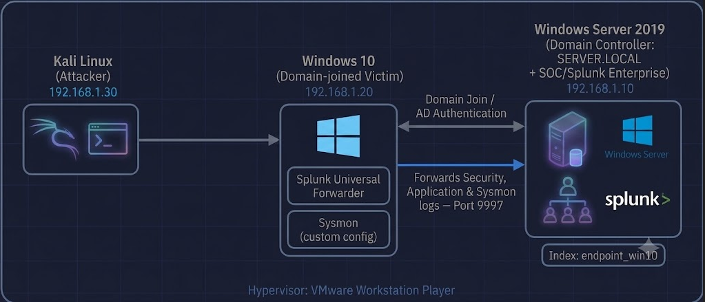

# Home SOC Environment (Self-Built)

A self-designed SOC lab — Windows Server 2019 (AD DS) + Windows 10 (domain-joined) + Kali Linux + Splunk Enterprise with Universal Forwarder and Sysmon. Built end-to-end (network → domain → SIEM → attack simulation) to demonstrate hands-on infrastructure and detection engineering skills.

**Status:** Core environment built and validated — from network setup, through AD DS and SIEM deployment, to a full attack simulation with a working Splunk detection and alert. Evolving project — more components (e.g. pfSense) will be added over time.



| Machine | Role | IP Address |
|---|---|---|
| Kali Linux | Attacker | `192.168.1.X` |
| Windows Server 2019 | Domain Controller (AD DS) + SOC server (Splunk) | `192.168.1.10` |
| Windows 10 | Domain-joined victim/endpoint | `192.168.1.20` |

**Domain:** `SERVER.LOCAL` (NetBIOS: `AD`) · **Splunk index:** `endpoint_win10`

---

## Modules

| # | Module | Summary | Status |
|---|---|---|---|
| 01 | [Architecture & Network Setup](./01-Architecture-and-Network-Setup) | Static IPs + connectivity verification across all VMs | ✅ |
| 02 | [Active Directory Domain Setup](./02-Active-Directory-Domain-Setup) | AD DS forest `SERVER.LOCAL`, Windows 10 domain-joined | ✅ |
| 03 | [Splunk Deployment](./03-Splunk-Deployment) | Splunk Enterprise + Universal Forwarder + Sysmon → `endpoint_win10` | ✅ |
| 04 | [Attack Simulation & Detection](./04-Attack-Simulation-and-Detection) | SMB brute force (Metasploit) → SPL detection → scheduled alert | ✅ |

### Attack 1 — Brute Force (SMB) · MITRE ATT&CK T1110

Brute-forced `AD\Khaled` over SMB using Metasploit, then built a Splunk detection correlating failed/successful logons (4625/4624):

```spl
index=endpoint_win10 (EventCode=4625 OR EventCode=4624)
| stats count(eval(EventCode=4625)) as Failed count(eval(EventCode=4624)) as Success by Account_Name
| where Failed>=5 AND Success>0
```

Configured a scheduled, throttled **High**-severity alert. Full write-up (incident response steps, screenshots) in [Module 04](./04-Attack-Simulation-and-Detection/Attack_1_Brute_Force.md).

---

## Skills Demonstrated

- Network design & AD DS deployment
- Splunk SIEM deployment, indexing strategy, Universal Forwarder + Sysmon
- SPL detection engineering & scheduled/throttled alerting
- MITRE ATT&CK mapping · Incident response planning

---

## Repo Structure

```
Home-SOC-Environment/
├── README.md
├── assets/
├── 01-Architecture-and-Network-Setup/
├── 02-Active-Directory-Domain-Setup/
├── 03-Splunk-Deployment/
└── 04-Attack-Simulation-and-Detection/
```

Separate from my guided [SOC-Analyst-Labs](https://github.com/khaled-sec/SOC-Analyst-Labs) repo — this one is fully self-designed, from network topology through attack simulation, for SOC analyst job applications.
